# Window Docker Jenkins 설치 및 github-webhook 연결

**Github 를 이용하여 push 시 자동으로 Hook 으로 신호가 가서 Jenkins 빌드까지**

## docker jenkins 컨테이너 생성 및 실행

```
docker run -itd --name jenkins-test -p 9090:8080 jenkins/jenkins:lts
//-itd : 
//-p : 호스트와 컨테이너 간의 포트 배포/바인드를 위해 사용 (포트포워딩)
```
### 옵션
1. itd (interactive terminal detach)
   - 컨테이너가 백그라운드로 작동하며, 표준 입력 터미널이 열린 상태가 되어 컨테이너가 계속 유지 된다.
2. p
   - 호스트와 컨테이너 간의 포트 배포/바인드를 위해 사용한다. (포트포워딩 용)


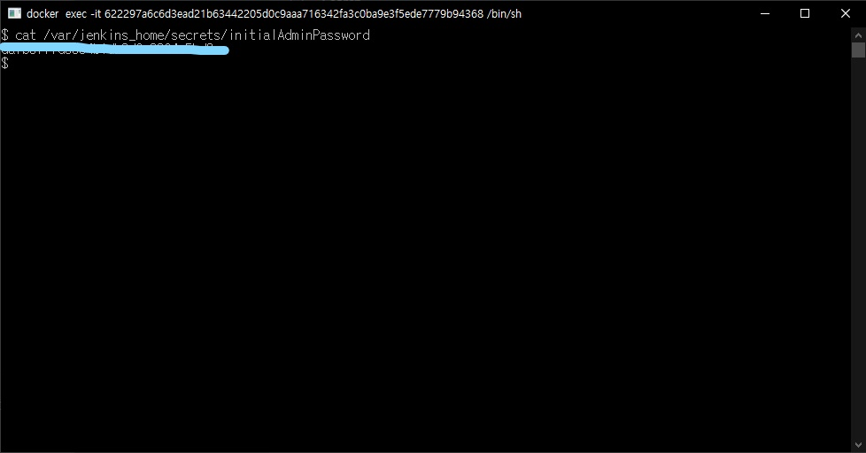

## Jenkins 설정

### 1. Administrator password 를 이용하여 Jenkins 로그인
   - 비밀번호는 ```/var/jenkins_home/secrets/initialAdminPassword``` 경로에 존재한다.
   - ```cat /var/jenkins_home/secrets/initialAdminPassword```
### 2. 플러그인 다운로드

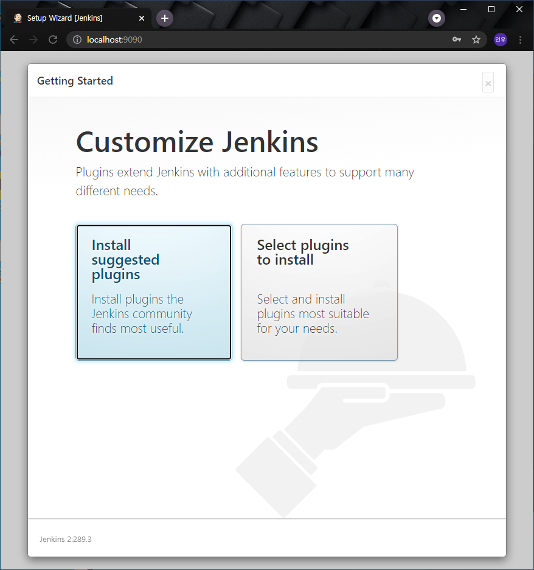

### 3. 계정 생성 (생략 가능)
### 4. 도메인 변경
   - github 에서 접근할 수 있도록 자신 ip로 변경

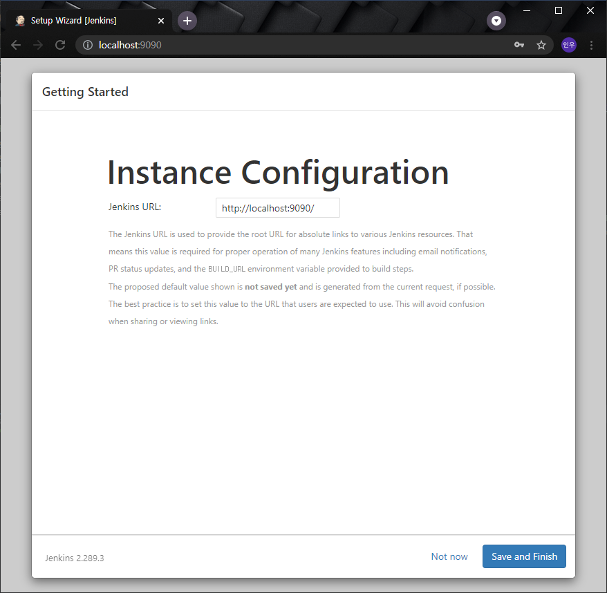

## Git 연동

### 1. Git Token 발급
   - Settings - Developer Settings - Personal Access Tokens - Generate New Token

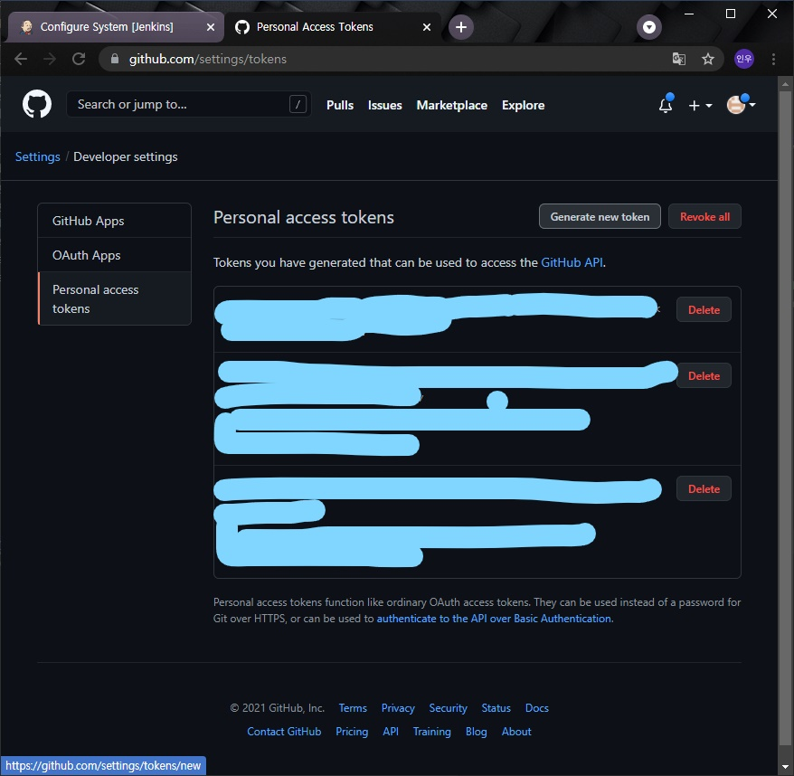

### 2. Jenkins 설정
   - 관리 - 시스템 설정 - git 추가 및 credentials add

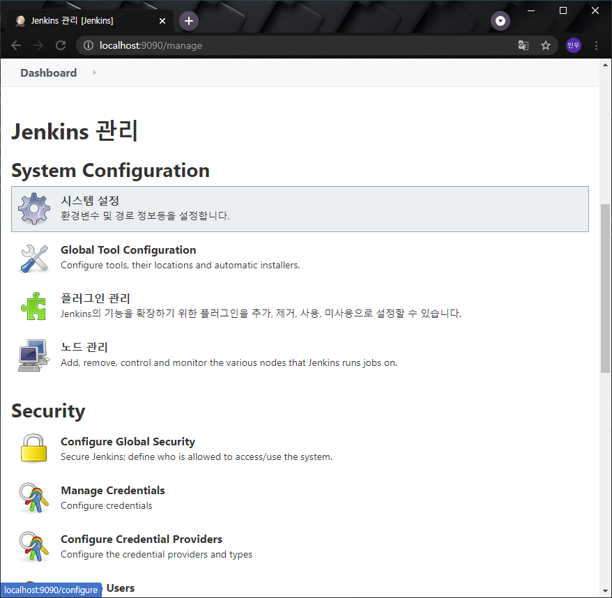

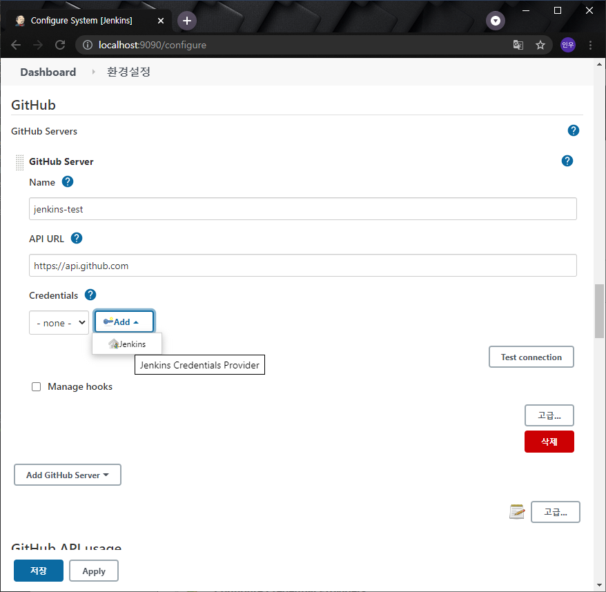

### 3. credentials 추가
   - kind - secret text 로 변경
   - secret - 발급 받은 git token 입력
   - id - 자신 식별자 값 입력 (임의의 값)

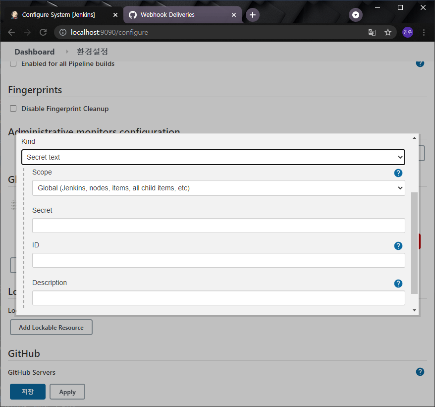

## Jenkins Item 생성

### 1. 새로운 Item 생성
   - freestyle project 생성

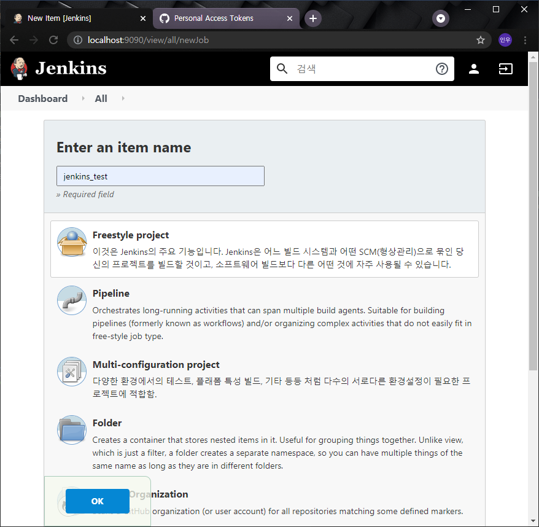
   
### 2. General
   - github project url 기입
   
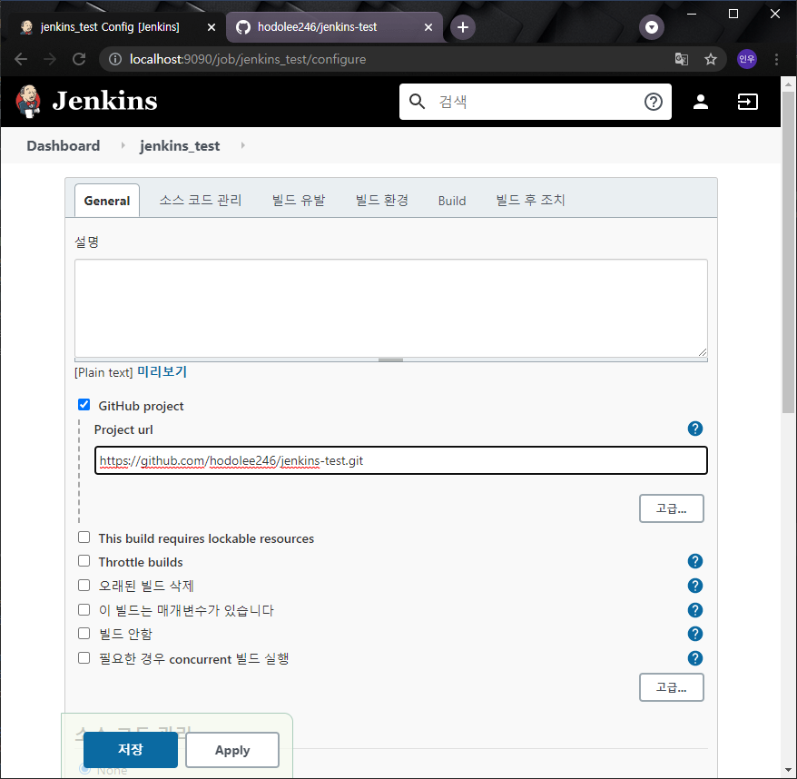

### 3. 소스 코드 관리
   - git url *.git 입력

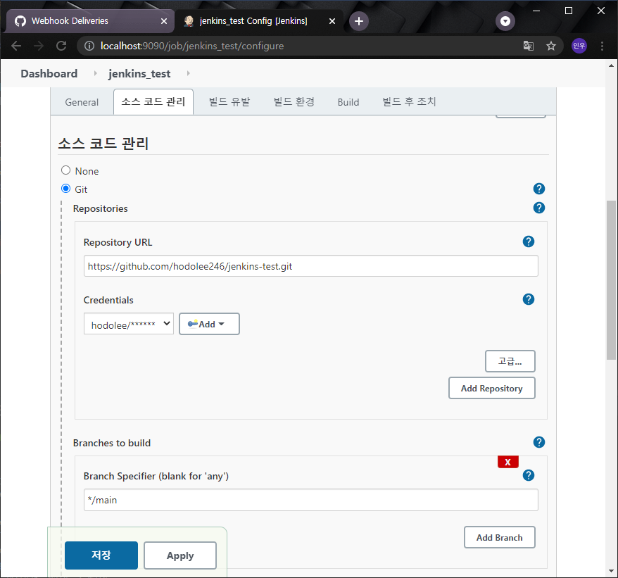

### 4. Credentials
   - kind - username with password
   - username - 깃 아이디 (이메일 아님)
   - password - 깃 패스워드
   - id - 자신 식별자 값 입력 (임의의 값)

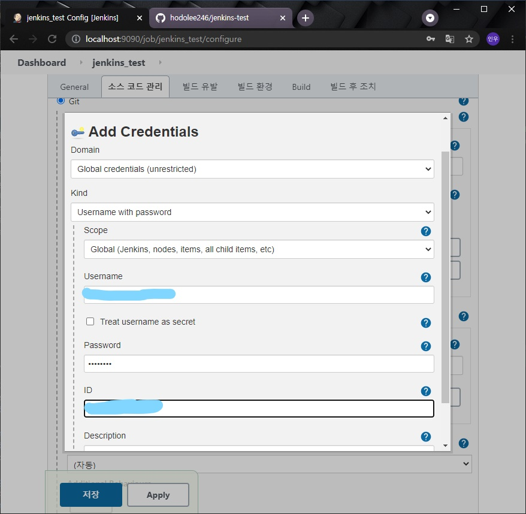

### 5. Branch 입력 및 빌드 유발
   - Branch 입력
      - github 기준 main branch push 시 Hook 타도록 설정
   - 빌드 유발
     - GitHub hook trigger for GITScm polling 체크

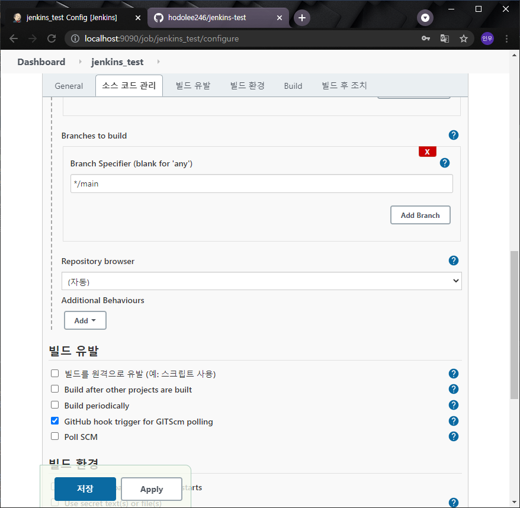

## Github Webhooks 연결

### 1. Webhooks 생성
   - 연동할 github 프로젝트의 Setting - Webhooks

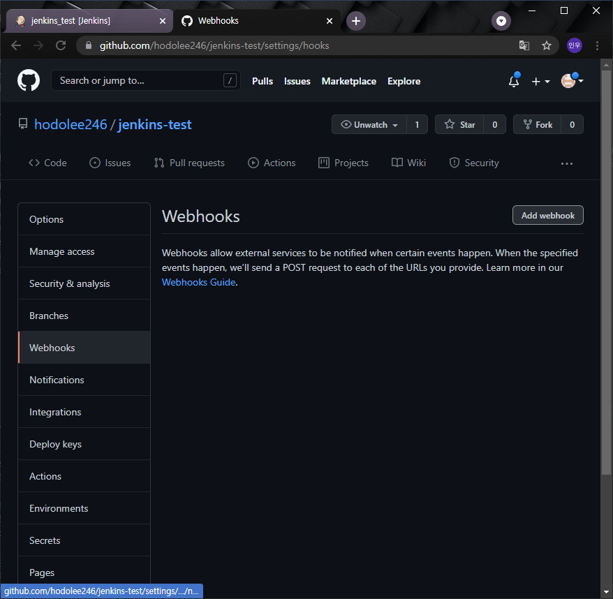

2. Payload URL 입력
   - 변경한 jenkins 도메인 및 ```/github-webhook/``` 입력 ```필수 입력``` 

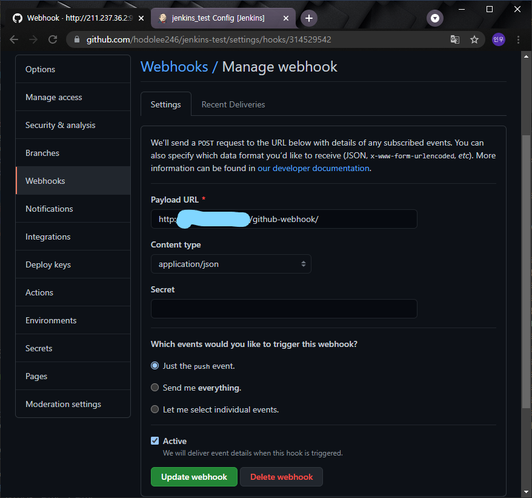